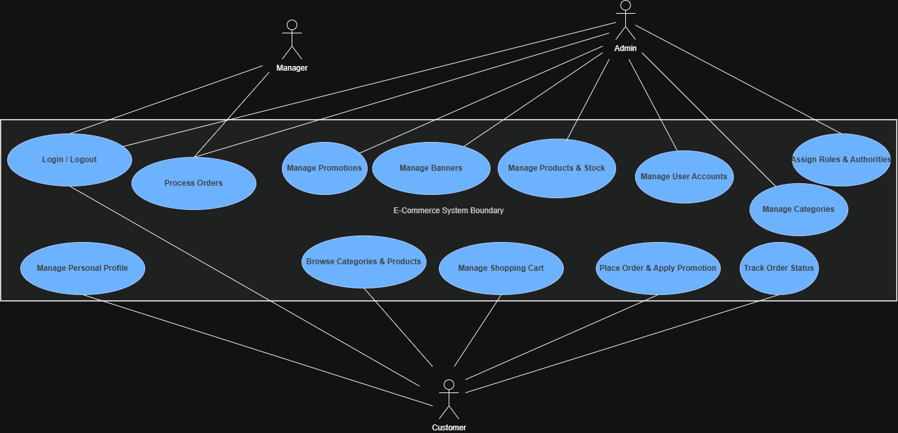
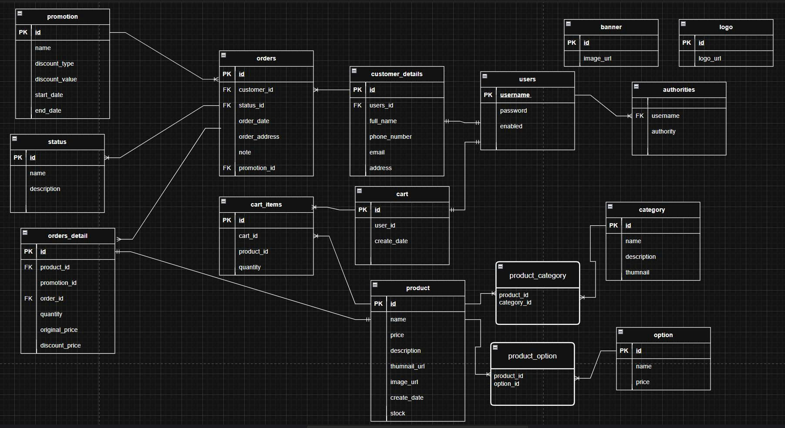
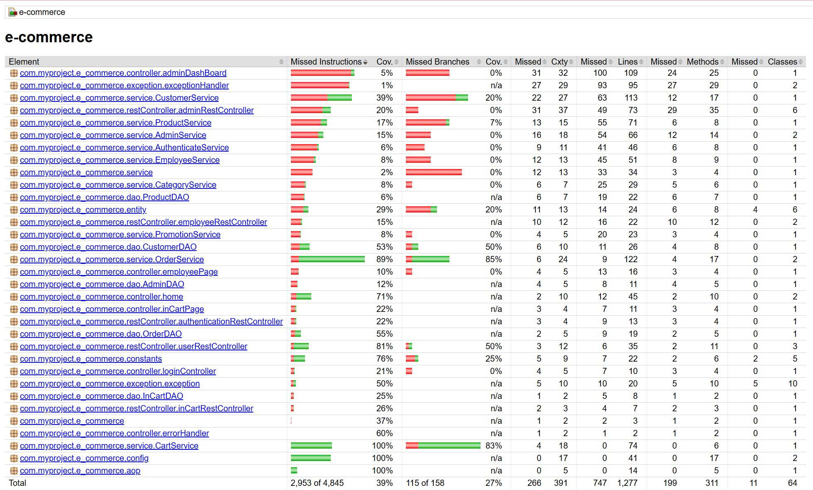
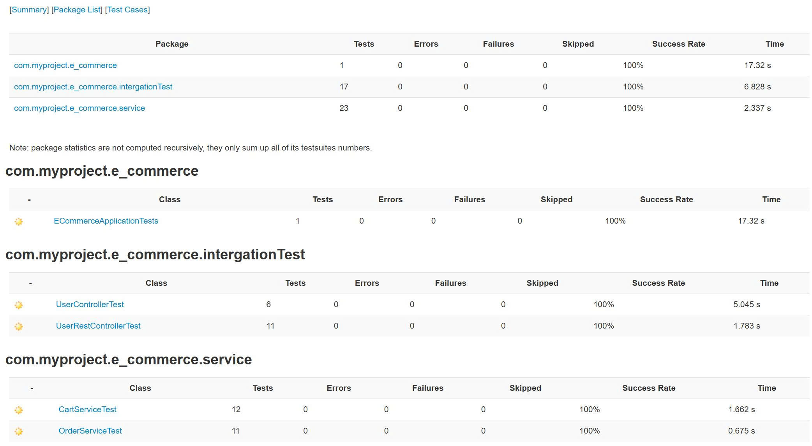

# 🛒 E-Commerce Platform

A comprehensive full-stack e-commerce application built with Spring Boot, featuring user authentication, product management, shopping cart, and order processing capabilities.

## 🚀 Features

### Core Functionality
- **User Authentication & Authorization** with role-based access control
- **Product Management** with categories and options
- **Shopping Cart** functionality with persistent storage
- **Order Processing** with status tracking
- **Admin Dashboard** for system management
- **Employee Interface** for order fulfillment
- **Promotion System** with discount management
- **Banner Management** for marketing

### Technical Features
- **Spring Security** with JWT authentication
- **JPA/Hibernate** for data persistence
- **Thymeleaf** templating engine
- **RESTful API** design
- **Docker** containerization
- **MySQL** database with comprehensive schema
- **AOP** for cross-cutting concerns
- **Comprehensive Testing** with JUnit and integration tests

## 🏗️ Architecture

### Technology Stack
- **Backend**: Spring Boot 4.0.2, Java 21
- **Security**: Spring Security, JWT (Nimbus JOSE + JWT)
- **Database**: MySQL 8.0, JPA/Hibernate
- **Frontend**: Thymeleaf, Bootstrap
- **Build Tool**: Maven
- **Containerization**: Docker, Docker Compose
- **Testing**: JUnit 5, Spring Boot Test, H2 (in-memory)
- **Documentation**: OpenAPI/Swagger
- **Logging**: SLF4J, Logback

### Project Structure
```
src/main/java/com/myproject/e_commerce/
├── ECommerceApplication.java          # Main Spring Boot Application
├── aop/                              # Aspect-Oriented Programming
├── config/                            # Configuration Classes
├── constants/                         # Application Constants
├── controller/                        # MVC Controllers
├── dao/                               # Data Access Objects
├── dto/                               # Data Transfer Objects
├── entity/                            # JPA Entities
├── exception/                         # Custom Exceptions
├── repository/                         # Spring Data JPA Repositories
├── response/                          # API Response Classes
├── restController/                    # REST API Controllers
└── service/                           # Business Logic Layer
```
### 🛒 Use Case Analysis
The E-Commerce System consists of three primary actors: Customer, Manager, and Admin, each with specific responsibilities within the system boundary.

1. Customer (End User)
   Focuses on the shopping experience and personal account management:

Authentication: Login/Logout and managing personal profile details.

Shopping Flow: Browsing products/categories, managing the shopping cart, and placing orders (including applying promotions).

Post-Purchase: Tracking real-time order status.

2. Manager (Operational Staff)
   Handles the day-to-day business operations:

Order Fulfillment: Processing and updating customer orders.


3. Admin (System Administrator)
   Oversees the entire system and security:

Inheritance: Can access to  Manager functionalities.

User Management: Creating, updating, and managing user accounts.

Access Control: Assigning specific roles and authorities (RBAC) to ensure system security.

Inventory & Content: Managing product details, stock levels, categories, and marketing banners.

Marketing: Setting up and managing promotional campaigns.

## 📊 Database Schema

### Core Entities
- **Users & Authorities**: Authentication and role management
- **Products & Categories**: Product catalog with categorization
- **Orders & OrderDetails**: Order processing and tracking
- **Cart & CartItems**: Shopping cart functionality
- **Promotions**: Discount and campaign management
- **Banners**: Marketing content management
- **CustomerDetails**: User profile information

### Key Relationships
- Users → Authorities (One-to-Many)
- Users → CustomerDetails (One-to-One)
- Users → Cart (One-to-One)
- Products → Categories (Many-to-Many)
- Products → Options (Many-to-Many)
- Orders → OrderDetails (One-to-Many)
- Customers → Orders (One-to-Many)

## 🔐 Security & Authentication

### Role-Based Access Control
- **ROLE_ADMIN**: Full system access
- **ROLE_MANAGER**: Administrative functions
- **ROLE_CUSTOMER**: Shopping and order management

### Security Features
- Password encryption with BCrypt
- Session management
- CSRF protection
- JWT token-based authentication
- Method-level security annotations

## 🚀 Getting Started

### Prerequisites
- Java 21 or higher
- Maven 3.6 or higher
- Docker and Docker Compose
- MySQL 8.0 (if running locally)

### Quick Start with Docker
```bash
# Clone the repository
git clone <repository-url>
cd e-commerce

# Run with Docker Compose
docker-compose up -d

# Access the application
# Web App: http://localhost:8080
# API Docs: http://localhost:8080/my-ui.html
# MySQL: localhost:3307
```

### Local Development Setup
```bash
# Set up database
mysql -u root -p < init/init.sql

# Configure application.properties
spring.datasource.url=jdbc:mysql://localhost:3306/e-commerce
spring.datasource.username=your_username
spring.datasource.password=your_password

# Run the application
mvn spring-boot:run
```

## 📡 API Documentation

### Authentication Endpoints
- `POST /login` - User authentication
- `POST /logout` - User logout

### Product Management
- `GET /api/products` - List all products
- `GET /api/products/{id}` - Get product details
- `POST /api/products` - Create new product (Admin)
- `PUT /api/products/{id}` - Update product (Admin)
- `DELETE /api/products/{id}` - Delete product (Admin)

### Shopping Cart
- `GET /api/cart` - View cart contents
- `POST /api/cart/add` - Add item to cart
- `PUT /api/cart/update` - Update cart item
- `DELETE /api/cart/remove/{id}` - Remove item from cart

### Order Management
- `GET /api/orders` - List user orders
- `POST /api/orders` - Create new order
- `GET /api/orders/{id}` - Get order details
- `PUT /api/orders/{id}/status` - Update order status (Employee/Admin)

### Admin Functions
- `GET /api/admin/dashboard` - Admin dashboard data
- `POST /api/admin/products` - Add product
- `POST /api/admin/categories` - Add category
- `POST /api/admin/banners` - Add banner
- `POST /api/admin/promotions` - Create promotion

## 🧪 Testing

### Running Tests
```bash
# Run all tests
mvn test

# Run with coverage
mvn clean test jacoco:report

# View coverage report
target/site/jacoco/index.html
```

### Test Categories
- **Unit Tests**: Service layer testing
- **Integration Tests**: Controller and database integration
- **Security Tests**: Authentication and authorization
- **API Tests**: REST endpoint functionality
- 
### 🧪 Testing & Quality Assurance
- The project prioritizes the verification of core system components, specifically focusing on the order fulfillment and shopping cart workflows to ensure the reliability of critical business logic.

### 📊 Coverage Overview
- While the overall project coverage stands at 39%, the testing strategy intentionally targets the most complex modules, achieving high coverage (>80%) for essential services.

### 🎯 Key Testing Highlights
- Business Logic Coverage: Achieved deep testing for CartService (100%) and OrderService (89%).
- Integration Testing: Completed comprehensive integration tests for UserController and UserRestController to ensure API endpoint reliability.
- Success Rate: All unit and integration tests currently pass with a 100% success rate.

## 📦 Deployment

### Docker Deployment
```bash
# Build Docker image
docker build -t e-commerce .

# Run container
docker run -p 8080:8080 e-commerce
```

### Production Considerations
- Environment variable configuration
- Database connection pooling
- Caching strategies
- Load balancing
- Monitoring and logging
- Backup strategies

## 🔧 Configuration

### Application Properties
```properties
# Database Configuration
spring.datasource.url=jdbc:mysql://localhost:3306/e-commerce
spring.datasource.username=username
spring.datasource.password=password

# File Upload
spring.servlet.multipart.max-file-size=10MB
spring.servlet.multipart.max-request-size=50MB

# Shop Configuration
shop.name=Your Shop Name
shop.slogan=Your Shop Slogan
orderAddress=Your Address

# API Documentation
springdoc.swagger-ui.path=/my-ui.html
springdoc.api-docs.path=/my-api-docs
```

## 🎯 Default Credentials

### Admin Account
- **Username**: admin
- **Password**: 123123

### Test Customer Accounts
- **Username**: customer1 / **Password**: 123123
- **Username**: customer2 / **Password**: 123123

## 📈 Performance & Scalability

### Optimization Features
- Database indexing on frequently queried columns
- Connection pooling with HikariCP
- Lazy loading for JPA relationships
- Caching strategies for static content
- Image optimization and CDN readiness

### Scalability Considerations
- Stateless application design
- Horizontal scaling capability
- Database replication support
- Microservices-ready architecture

## 🔍 Monitoring & Logging

### Logging Configuration
- Structured logging with SLF4J
- Different log levels for environments
- AOP-based method logging
- Error tracking and alerting

### Health Checks
- Spring Boot Actuator endpoints
- Database connectivity monitoring
- Application health metrics
- Docker health checks

## 🤝 Contributing

1. Fork the repository
2. Create a feature branch (`git checkout -b feature/AmazingFeature`)
3. Commit your changes (`git commit -m 'Add some AmazingFeature'`)
4. Push to the branch (`git push origin feature/AmazingFeature`)
5. Open a Pull Request

## 📝 License

This project is licensed under the MIT License - see the LICENSE file for details.

## 📞 Support

For support and questions:
- Create an issue in the repository
- Check the API documentation at `/my-ui.html`
- Review the application logs for troubleshooting

## 🏆 Project Highlights

### Technical Achievements
- **Clean Architecture**: Separation of concerns with layered design
- **Security First**: Comprehensive authentication and authorization
- **Test Coverage**: Extensive unit and integration testing
- **Container Ready**: Full Docker support for deployment
- **API Documentation**: Auto-generated OpenAPI/Swagger docs
- **Performance**: Optimized database queries and caching

### Business Features
- **Multi-role System**: Admin, Manager, and Customer roles
- **Complete E-commerce Flow**: Browse → Cart → Order → Track
- **Promotion Engine**: Flexible discount system
- **Order Management**: Full lifecycle tracking
- **Content Management**: Banner and product management

---
